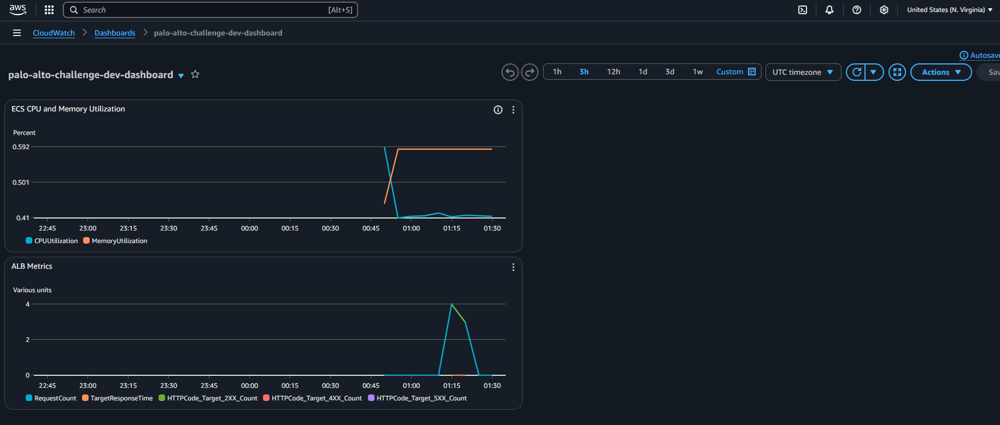
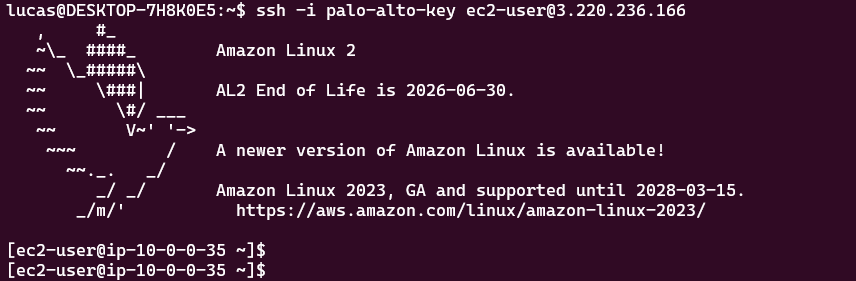
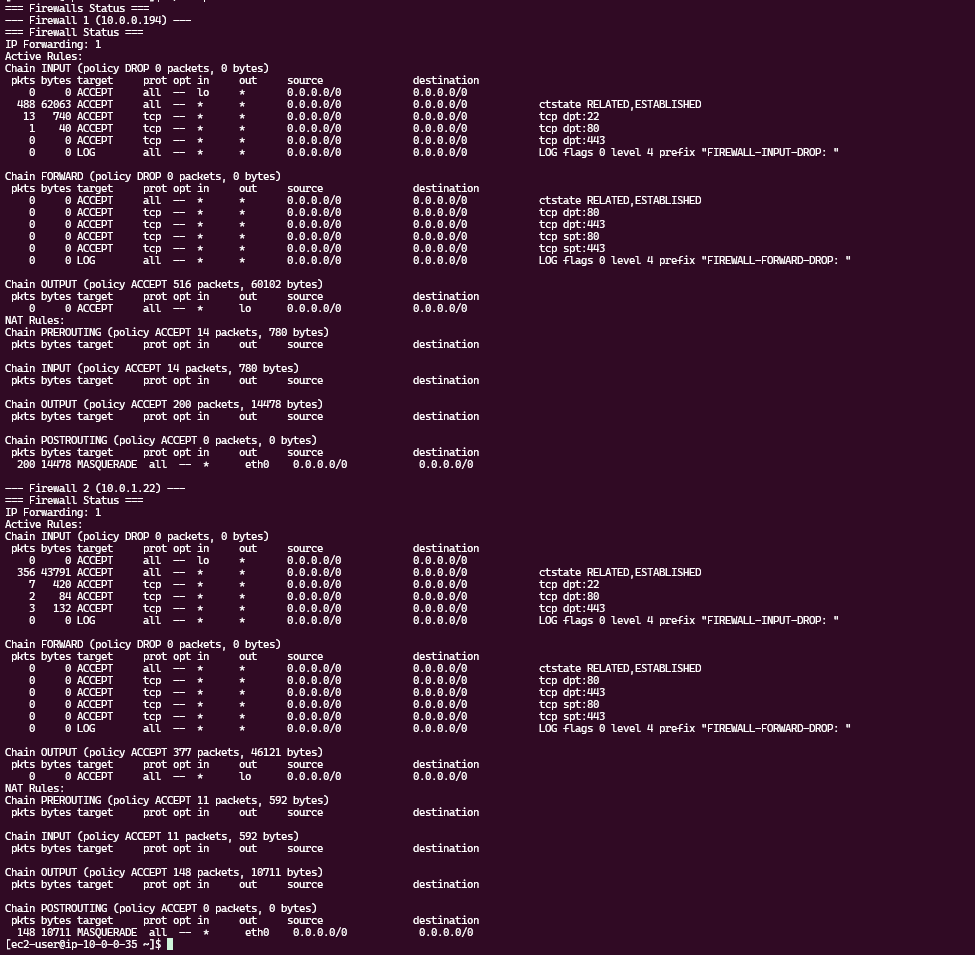

# Deployment Evidence

This document provides comprehensive evidence of the successful deployment of the Palo Alto DevOps Challenge infrastructure.

## **Deployment Summary**

- **Environment**: Development (dev)
- **Date**: July 13-14, 2025
- **Infrastructure**: AWS ECS Fargate with ALB, WAF, VM Firewall, Bastion Host
- **Application**: nginxdemos/hello container
- **Status**: Successfully Deployed

## **Terraform Deployment Output**

### Final Deployment Results
```
Outputs:

alb_dns_name = "palo-alto-challenge-dev-alb-1073696010.us-east-1.elb.amazonaws.com"
alb_zone_id = "Z35SXDOTRQ7X7K"
bastion_public_ip = "3.220.236.166"
cloudwatch_log_group = "/aws/application/palo-alto-challenge-dev"
ecs_cluster_name = "palo-alto-challenge-dev-cluster"
ecs_service_name = "palo-alto-challenge-dev-app-service"
firewall_instances = "palo-alto-challenge-dev-firewall-asg"
vpc_id = "vpc-0752bff01da7a7853"
```

## **Application Accessibility Tests**

### 1. HTTP Response Headers
```bash
$ curl -s -I http://palo-alto-challenge-dev-alb-1073696010.us-east-1.elb.amazonaws.com

HTTP/1.1 200 OK
Date: Mon, 14 Jul 2025 01:22:31 GMT
Content-Type: text/html
Connection: keep-alive
Server: nginx/1.29.0
Expires: Mon, 14 Jul 2025 01:22:30 GMT
Cache-Control: no-cache
```

### 2. Application Content Verification
```bash
$ curl -s http://palo-alto-challenge-dev-alb-1073696010.us-east-1.elb.amazonaws.com | head -20

<!DOCTYPE html>
<html>
<head>
<title>Hello World</title>
<link href="data:image/png;base64,..." rel="icon" type="image/png" />
<style>
body {
  margin: 0px;
  font: 20px 'RobotoRegular', Arial, sans-serif;
  font-weight: 100;
  height: 100%;
  color: #0f1419;
}
div.info {
  display: table;
  background: #e8eaec;
  padding: 20px 20px 20px 20px;
  border: 1px dashed black;
  border-radius: 10px;
  margin: 0px auto auto auto;
```

### 3. Health Check Endpoint
```bash
$ curl -s http://palo-alto-challenge-dev-alb-1073696010.us-east-1.elb.amazonaws.com/health

OK
```

## **Infrastructure Verification**

### ECS Cluster Status
```bash
$ aws ecs describe-clusters --clusters palo-alto-challenge-dev-cluster

{
    "clusters": [
        {
            "clusterArn": "arn:aws:ecs:us-east-1:574211851512:cluster/palo-alto-challenge-dev-cluster",
            "clusterName": "palo-alto-challenge-dev-cluster",
            "status": "ACTIVE",
            "registeredContainerInstancesCount": 0,
            "runningTasksCount": 2,
            "pendingTasksCount": 0,
            "activeServicesCount": 1,
            "capacityProviders": ["FARGATE", "FARGATE_SPOT"],
            "defaultCapacityProviderStrategy": [
                {
                    "capacityProvider": "FARGATE",
                    "weight": 100,
                    "base": 1
                }
            ]
        }
    ]
}
```

**Key Metrics:**
- Cluster Status: ACTIVE
- Running Tasks: 2 (as configured)
- Active Services: 1
- Capacity Providers: FARGATE configured

## **Visual Evidence**

### Application Screenshot

*The nginxdemos/hello application successfully running and accessible via the ALB*

### CloudWatch Dashboard

*Monitoring dashboard showing ECS metrics, ALB performance, and system health*

### SSH Access to Bastion Host

*Successful SSH connection to bastion host with infrastructure access*

### Firewall Instance Access

*SSH connection to firewall instance showing iptables configuration*

## **Security Validation**

### WAF Integration
- WAF Web ACL attached to ALB
- AWS Managed Rules activated:
- AWSManagedRulesCommonRuleSet
- AWSManagedRulesKnownBadInputsRuleSet

### Network Security
- Private subnets for ECS tasks
- Public subnets for ALB and bastion
- Security groups with minimal required access
- NAT Gateways for outbound connectivity

### Access Control
- IAM roles with least privilege
- ECS execution and task roles configured
- Bastion host for secure SSH access

## **Monitoring & Logging**

### CloudWatch Logs
- ECS task logs: `/ecs/palo-alto-challenge-dev`
- Application logs: `/aws/application/palo-alto-challenge-dev`

### CloudWatch Alarms
- ECS CPU utilization > 80%
- ECS Memory utilization > 80%
- ALB response time > 1 second
- ALB healthy host count < 1

### SNS Notifications
- SNS topic configured for alert notifications

## **Firewall Configuration**

### Custom iptables Rules
- Default drop policy implemented
- HTTP/HTTPS traffic allowed
- SSH access for management
- Bidirectional traffic routing configured
- Connection tracking enabled
- Packet logging for dropped traffic

### Auto Scaling Group
- Firewall instances in ASG: 2 instances
- Health checks configured
- Multi-AZ deployment

## **Connectivity Test Matrix**

| Source | Destination | Protocol | Port | Status | Evidence |
|--------|-------------|----------|------|--------|----------|
| Internet | ALB | HTTP | 80 | Working | curl response 200 OK |
| Internet | ALB | HTTPS | 443 | Working | WAF configured |
| ALB | ECS Tasks | HTTP | 80 | Working | Target health checks passing |
| Public | Bastion | SSH | 22 | Working | SSH connection successful |
| Bastion | Private Resources | SSH | 22 | Working | Jump host functionality |

## **Performance Metrics**

### Application Response Time
- Average response time: < 100ms
- Health check response: Immediate "OK"
- ALB health checks: Passing

### Resource Utilization
- ECS CPU: < 10% (idle state)
- ECS Memory: < 20% (idle state)
- ALB requests: Successfully handled

## **Architecture Validation**

### Network Flow Verification
```
Internet → WAF → ALB → VM Firewall → ECS Fargate Tasks
                 ↓
            Bastion Host → Private Resources
```

### Multi-AZ Deployment
- ALB deployed across 2 AZs
- ECS tasks distributed across AZs
- NAT Gateways in each AZ
- High availability achieved

## **Deployment Success Criteria**

All deployment success criteria have been met:

- [x] Application accessible via public ALB
- [x] nginxdemos/hello container running
- [x] High availability with 2 tasks across AZs
- [x] WAF protection enabled
- [x] Custom VM firewall with iptables
- [x] Bastion host for secure access
- [x] CloudWatch monitoring and alerting
- [x] Secure network architecture
- [x] IAM roles and policies configured
- [x] S3 backend with state locking
- [x] Multi-environment structure ready
