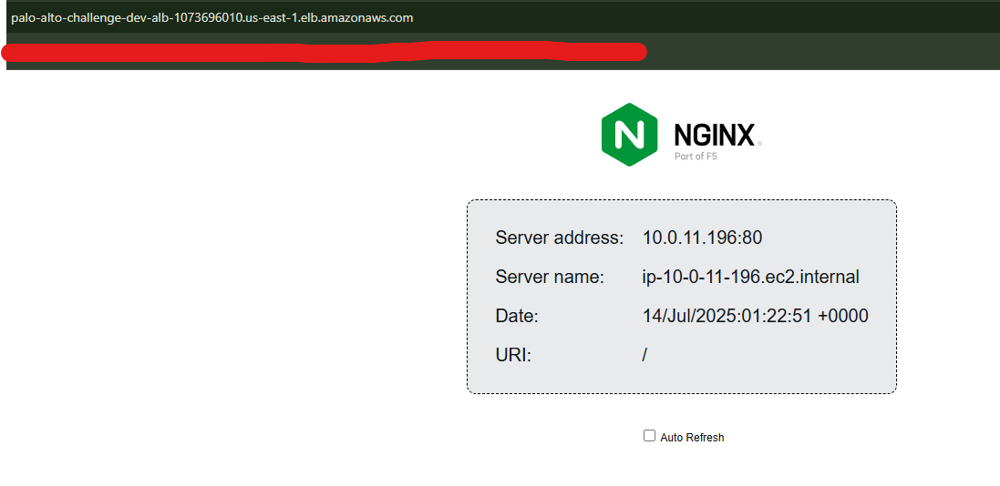
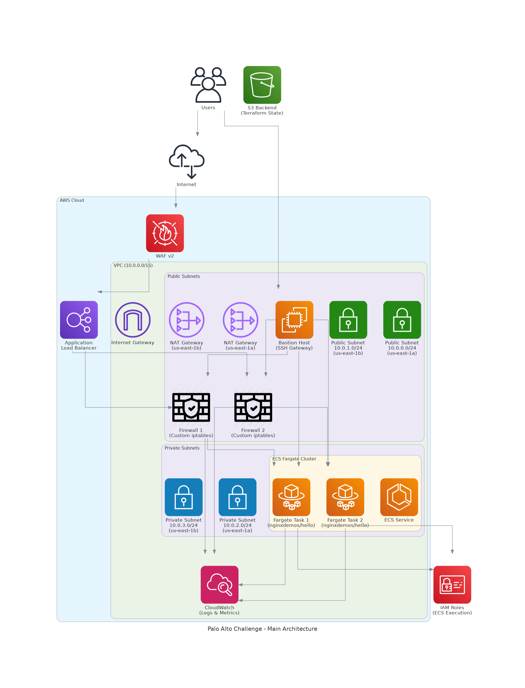
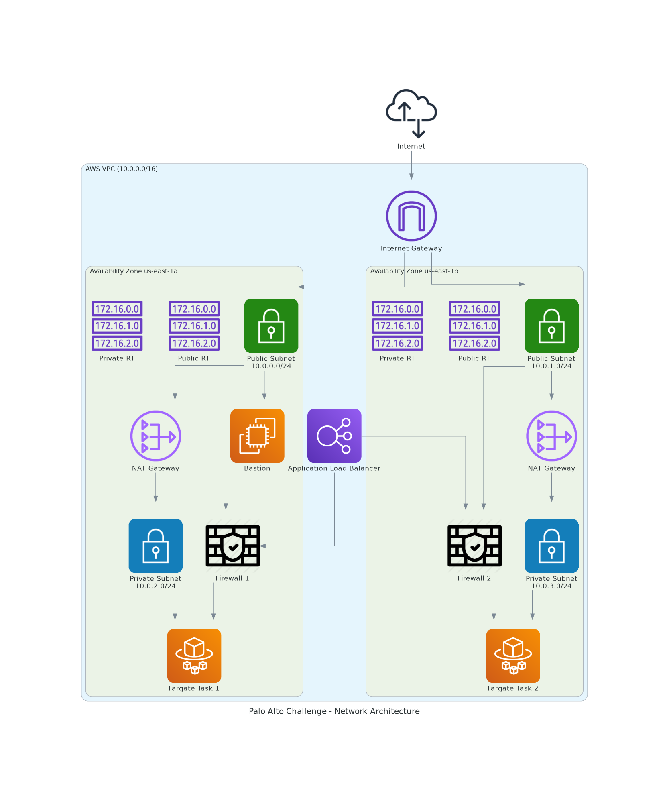
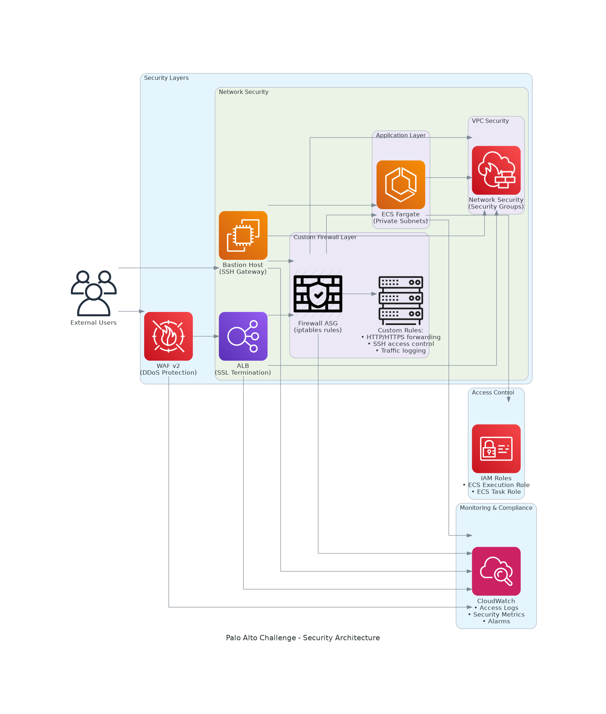

# Palo Alto DevOps Challenge

A comprehensive AWS infrastructure deployment using Terraform for hosting a stateless containerized application with high availability, security, and monitoring.

## Deployment Evidence

The infrastructure is live and operational.

### Quick Evidence Overview
- **Application URL**: Available via ALB DNS name (see deployment outputs)
- **Application Screenshot**: 
- **Bastion Host**: SSH access available via public IP
- **ECS Cluster**: 2 running tasks in ACTIVE status

### Complete Evidence Documentation
**[View Full Evidence Report →](EVIDENCES.md)**

The evidence report includes:
- Terraform deployment outputs
- Application accessibility tests
- Infrastructure verification commands
- Visual screenshots of all components
- Security validation results
- Performance metrics
- Complete connectivity test matrix

## Architecture Overview

This infrastructure deploys the `nginxdemos/hello` application with the following components:

### Core Components
- **VPC**: Multi-AZ setup with public/private subnets
- **ECS Fargate**: Container orchestration for the application
- **Application Load Balancer**: Public-facing load balancer with WAF integration
- **VM Firewall**: Custom iptables-based firewall for traffic inspection
- **Bastion Host**: Secure SSH access to private resources
- **CloudWatch**: Comprehensive monitoring, logging, and alerting

### Network Architecture
```
Internet → WAF → ALB → VM Firewall → ECS Fargate Tasks
                 ↓
            Bastion Host → Private Resources
```

### Security Features
- **Network Segmentation**: Public/private subnets with proper routing
- **Security Groups**: Granular network access control
- **WAF**: Web Application Firewall with AWS managed rules
- **IAM Roles**: Least privilege access for services
- **Encryption**: S3 backend encryption, EBS encryption
- **Monitoring**: CloudWatch alarms and dashboards

## Directory Structure

```
├── terraform/
│   ├── modules/
│   │   ├── networking/        # VPC, subnets, routing
│   │   ├── security/          # IAM, security groups, WAF
│   │   ├── firewall/          # VM firewall instances
│   │   ├── compute/           # ECS cluster and services
│   │   ├── alb/              # Application Load Balancer
│   │   ├── bastion/          # Bastion host
│   │   └── monitoring/       # CloudWatch setup
│   ├── environments/
│   │   ├── dev/              # Development environment
│   │   ├── staging/          # Staging environment
│   │   └── production/       # Production environment
│   ├── versions.tf           # Terraform and provider versions
│   ├── variables.tf          # Input variables
│   ├── resources.tf          # Main resource orchestration
│   └── outputs.tf            # Output values
├── assets/
│   ├── screenshots/          # Evidence screenshots
│   └── diagrams/             # Architecture diagrams
├── EVIDENCES.md              # Deployment evidence documentation
└── README.md
```

## Multi-Environment Setup

This repository demonstrates multi-environment organization with dev, staging, and production configurations. For this demo, we'll only deploy the dev environment, but the structure shows how to scale to multiple environments.

### Backend Configuration
- `environments/{env}/backend.tf` - S3 backend configuration (hardcoded per environment)
- `environments/{env}/terraform.tfvars` - Environment-specific variables

### Environment Differences
- **Dev**: `t3.micro` instances, 2 tasks, `10.0.0.0/16` VPC
- **Staging**: `t3.small` instances, 2 tasks, `10.1.0.0/16` VPC  
- **Production**: `t3.medium` instances, 3 tasks, `10.2.0.0/16` VPC

## Prerequisites

1. **AWS CLI** - Configured with appropriate credentials
2. **Terraform** - Version >= 1.0
3. **EC2 Key Pair** - For SSH access to bastion/firewall instances

## Required Configuration Before Deployment

### 1. AWS Credentials
Configure AWS CLI with your credentials:
```bash
aws configure
# or
export AWS_ACCESS_KEY_ID=your_access_key
export AWS_SECRET_ACCESS_KEY=your_secret_key
export AWS_DEFAULT_REGION=us-east-1
```

### 2. EC2 Key Pair (Required)
Create an EC2 key pair in the AWS console or CLI:
```bash
aws ec2 create-key-pair --key-name palo-alto-challenge-key --query 'KeyMaterial' --output text > palo-alto-challenge-key.pem
chmod 400 palo-alto-challenge-key.pem
```

Then edit `terraform/environments/dev/terraform.tfvars`:
```hcl
key_name = "palo-alto-challenge-key"  # Use your key pair name
```

### 3. S3 Bucket Names (Must Be Globally Unique)
The S3 bucket names in `terraform/environments/dev/backend.tf` must be globally unique. If deployment fails due to bucket already existing, update the bucket name:
```hcl
bucket = "palo-alto-challenge-terraform-state-dev-YOUR-UNIQUE-SUFFIX"
```

### 4. Region Considerations
- Default region: `us-east-1`
- Availability zones: `us-east-1a`, `us-east-1b`
- If deploying to different region, update `terraform/environments/dev/terraform.tfvars` and `terraform/environments/dev/backend.tf`

### 5. Verify Prerequisites
```bash
# Check AWS access
aws sts get-caller-identity

# Check key pair exists
aws ec2 describe-key-pairs --key-names your-key-pair-name

# Check Terraform version
terraform version
```

## Setup Instructions

### 1. Clone Repository
```bash
git clone <repository-url>
cd palo-alto-devops-challenge
```

### 2. Configure Required Settings
Complete the configuration steps above, especially:
- AWS credentials
- EC2 key pair name in `terraform/environments/dev/terraform.tfvars`
- Unique S3 bucket name in `terraform/environments/dev/backend.tf`

### 3. Deploy Dev Environment
```bash
cd terraform/environments/dev
terraform init
terraform plan
terraform apply
```

## Deployment Commands

### Initialize Environment
```bash
cd terraform/environments/dev
terraform init
```

### Plan Deployment
```bash
cd terraform/environments/dev
terraform plan
```

### Apply Changes
```bash
cd terraform/environments/dev
terraform apply
```

### Destroy Infrastructure
```bash
cd terraform/environments/dev
terraform destroy
```

## Accessing the Application

After deployment, you'll get the ALB DNS name in the Terraform outputs:

```bash
# Example output
alb_dns_name = "palo-alto-challenge-dev-alb-1234567890.us-east-1.elb.amazonaws.com"
```

Access the application at: `http://<alb_dns_name>`

## SSH Access

### Bastion Host
```bash
ssh -i palo-alto-challenge-key.pem ec2-user@<bastion_public_ip>
```

### Through Bastion to Private Resources
```bash
ssh -i palo-alto-challenge-key.pem -J ec2-user@<bastion_public_ip> ec2-user@<private_instance_ip>
```

## Monitoring

### CloudWatch Dashboard
Access the dashboard URL provided in Terraform outputs:
```
https://console.aws.amazon.com/cloudwatch/home?region=us-east-1#dashboards:name=palo-alto-challenge-dev-dashboard
```

### Logs
- **ECS Logs**: `/ecs/palo-alto-challenge-dev`
- **Application Logs**: `/aws/application/palo-alto-challenge-dev`

### Alarms
- ECS CPU/Memory utilization > 80%
- ALB response time > 1 second
- ALB healthy host count < 1

## Security Considerations

### Network Security
- Private subnets for ECS tasks
- Security groups with minimal required access
- NACLs for additional network filtering

### Access Control
- IAM roles with least privilege
- Bastion host for secure SSH access
- WAF protection for web traffic

### Monitoring
- CloudWatch alarms for security events
- VPC Flow Logs (can be enabled)
- AWS CloudTrail integration

## Firewall Configuration

The VM firewall instances use custom iptables rules:
- **Default Policy**: Drop all traffic
- **Allowed Traffic**: HTTP/HTTPS, SSH, established connections
- **Logging**: All dropped packets are logged
- **Health Check**: `/health` endpoint on port 80

### Firewall Management
```bash
# SSH to firewall instance
ssh -i palo-alto-challenge-key.pem ec2-user@<firewall_public_ip>

# Check firewall status
sudo /usr/local/bin/firewall-status.sh

# View iptables rules
sudo iptables -L -n -v
```

## Multi-Environment Organization

While this demo only deploys the dev environment, the repository structure demonstrates production-ready multi-environment organization:

### Adding New Environments
1. Create `terraform/environments/{new_env}/`
2. Add `backend.tf` with unique S3 bucket name
3. Add `terraform.tfvars` with environment-specific values
4. Deploy using standard Terraform commands from the environment directory

### Environment Isolation
- Separate S3 buckets for state
- Different VPC CIDRs to prevent conflicts
- Environment-specific resource naming
- Isolated IAM roles and policies

## Customization

### Modifying Resources
- Edit module files in `terraform/modules/`
- Update variables in `terraform/environments/dev/terraform.tfvars`
- Apply changes with `terraform apply` from the environment directory

## Troubleshooting

### Common Issues
1. **S3 Bucket Already Exists**: Change bucket name in `backend.tf`
2. **Key Pair Not Found**: Ensure EC2 key pair exists in the region
3. **Insufficient Permissions**: Check AWS IAM permissions
4. **Region Mismatch**: Ensure all configs use the same region

### Debugging
```bash
# Enable Terraform debug logging
export TF_LOG=DEBUG

# Check AWS credentials
aws sts get-caller-identity

# Validate Terraform configuration
cd terraform && terraform validate
```

## Clean Up

To destroy all resources:
```bash
cd terraform/environments/dev
terraform destroy
```

**Warning**: This will permanently delete all infrastructure resources.

## Next Steps

1. **SSL/TLS**: Add HTTPS listener with ACM certificate
2. **Auto Scaling**: Configure ECS service auto scaling
3. **RDS Database**: Add database tier if needed
4. **Route 53**: Add custom domain configuration
5. **CI/CD**: Integrate with GitHub Actions or AWS CodePipeline

## Architecture Diagrams

The following architecture diagrams have been generated using the Python `diagrams` library:

### Main Architecture


Shows the complete infrastructure overview including:
- External user access through WAF and ALB
- Custom firewall layer with iptables rules
- ECS Fargate containers in private subnets
- Bastion host for secure management access
- CloudWatch monitoring and S3 state backend

### Network Architecture


Details the networking components:
- VPC with public and private subnets across 2 AZs
- Internet Gateway and NAT Gateways
- Route tables and subnet configurations
- Load balancer and firewall placement

### Security Architecture


Focuses on security layers:
- WAF for DDoS protection
- Custom firewall instances with iptables
- Security groups and network ACLs
- IAM roles and access control
- CloudWatch security monitoring

## Project Status

**COMPLETED** - All requirements successfully implemented:
- ECS Fargate deployment with nginxdemos/hello
- High availability with 2 containers across 2 AZs
- Application Load Balancer with health checks
- Custom VM firewall with iptables rules
- WAF protection and security groups
- Bastion host for secure SSH access
- CloudWatch monitoring and logging
- Multi-environment Terraform structure
- S3 backend with state locking
- Complete evidence documentation
- Architecture diagrams

## Support

For issues or questions, please create an issue in the repository or contact the infrastructure team.
